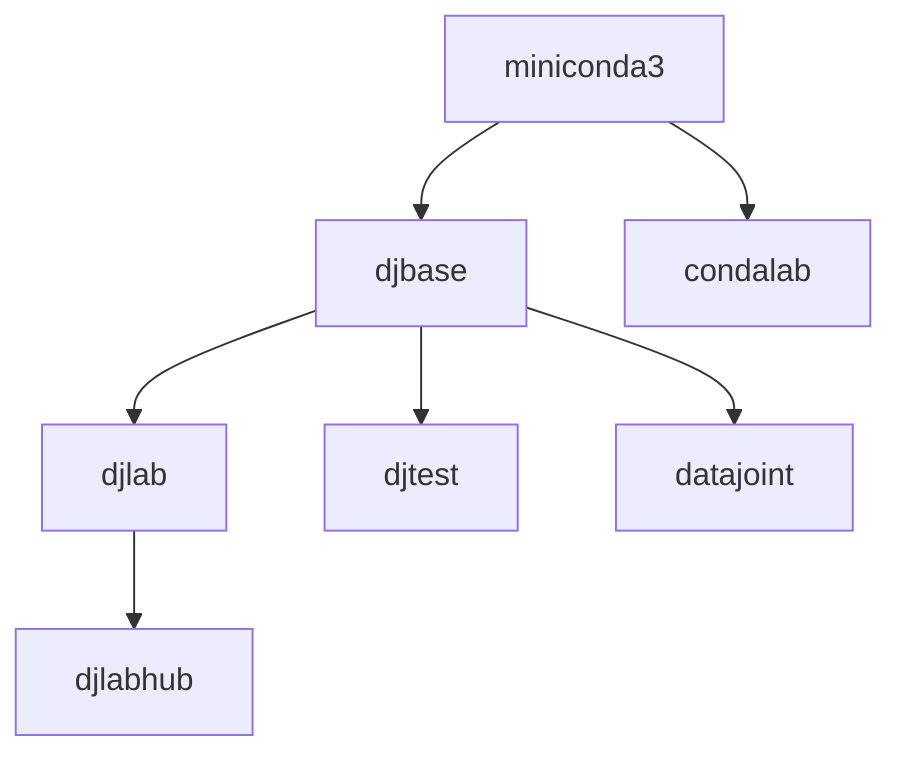

# DataJoint Image Stack

The following demonstrates the DataJoint open-source image stack:

```mermaid
flowchart TD
    miniconda3 --> djbase;
    miniconda3 --> condalab;
    djbase --> djlab;
    djbase --> djtest;
    djbase --> datajoint;
    djlab --> djlabhub;
```